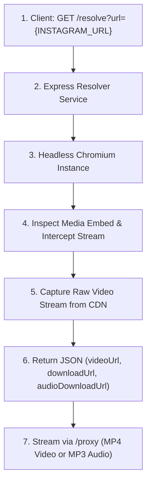

# Instagram Headless Chromium Media Resolver API

A high-performance Node.js microservice that runs a lightweight headless Chromium instance to extract direct `.mp4` video streams and progressive audio chunks from Instagram Reels, Posts, and Videos, complete with built-in streaming download endpoints.

---

## Features

- **Automated Stream Interception:** Captures progressive video streams directly from Instagram CDN endpoints.
- **Full Media API:** Provides both raw CDN stream links, direct MP4 video download URLs, and MP3 audio download URLs.
- **Built-in Proxy Streamer:** `/proxy` endpoint bypasses CORS and serves files with proper `Content-Disposition` attachment headers.
- **Optimized Performance:** Blocks unnecessary assets (images, stylesheets, fonts) to minimize memory usage and resolve media in seconds.
- **Flexible Parameters:** Accepts either a full Instagram URL or an extracted shortcode via GET query or POST JSON body.
- **Docker-Ready:** Pre-configured Dockerfile with Chromium and runtime dependencies ready for deployment.

---

## How It Works



---

## Endpoints

### 1. Health Check & Info
- **Endpoint:** `GET /`
- **Response:**
  ```json
  {
    "service": "Instagram Headless Media Resolver API",
    "status": "online",
    "endpoints": {
      "resolve": {
        "method": "GET | POST",
        "path": "/resolve?url={INSTAGRAM_URL}",
        "example": "http://localhost:3000/resolve?url=https://www.instagram.com/reel/DbFXzUHoDFf/",
        "description": "Resolves direct video stream, MP4 download link, and MP3 audio download link."
      },
      "proxy": {
        "method": "GET",
        "path": "/proxy?url={VIDEO_STREAM_URL}&format={video|audio}",
        "description": "Streams media directly with CORS headers and attachment headers for instant file download."
      }
    }
  }
  ```

### 2. Resolve Media (Video & Audio)
- **Endpoint:** `GET /resolve?url={INSTAGRAM_URL}` or `POST /resolve`
- **Aliases:** `/download`, `/api/download`
- **Example Request:**
  ```bash
  curl "http://localhost:3000/resolve?url=https://www.instagram.com/reel/DbFXzUHoDFf/"
  ```
- **Success Response (`200 OK`):**
  ```json
  {
    "success": true,
    "status": "success",
    "shortcode": "DbFXzUHoDFf",
    "videoUrl": "https://scontent-xxx.cdninstagram.com/v/t50.2886-16/...",
    "downloadUrl": "http://localhost:3000/proxy?url=https%3A%2F%2Fscontent-xxx...",
    "audioDownloadUrl": "http://localhost:3000/proxy?url=https%3A%2F%2Fscontent-xxx...&format=audio",
    "audioUrl": "http://localhost:3000/proxy?url=https%3A%2F%2Fscontent-xxx...&format=audio"
  }
  ```
- **Error Response (`404 Not Found`):**
  ```json
  {
    "success": false,
    "status": "error",
    "error": "Unable to extract video stream. Post may be private or removed.",
    "shortcode": "DbFXzUHoDFf"
  }
  ```

### 3. Media Stream Proxy (MP4 Video & MP3 Audio)
- **Video Download:**
  ```
  GET /proxy?url={VIDEO_STREAM_URL}
  ```
  Streams video as `attachment; filename="instagram_video.mp4"` with `video/mp4` MIME type.
- **Audio Download:**
  ```
  GET /proxy?url={VIDEO_STREAM_URL}&format=audio
  ```
  Streams audio as `attachment; filename="instagram_audio.mp3"` with `audio/mpeg` MIME type.

---

## Local Development

### Option A: Using Docker (Recommended)

1. **Build Docker image:**
   ```bash
   docker build -t instagram-render-resolver .
   ```

2. **Run container:**
   ```bash
   docker run -p 3000:3000 instagram-render-resolver
   ```

3. **Test the endpoint:**
   ```bash
   curl "http://localhost:3000/resolve?shortcode=DbFXzUHoDFf"
   ```

### Option B: Running with Node.js directly

1. **Install dependencies:**
   ```bash
   npm install
   ```

2. **Set Chromium executable path:**
   ```bash
   # Windows (example)
   set PUPPETEER_EXECUTABLE_PATH="C:\Program Files\Google\Chrome\Application\chrome.exe"

   # Linux (example)
   export PUPPETEER_EXECUTABLE_PATH="/usr/bin/chromium"
   ```

3. **Start the server:**
   ```bash
   npm start
   ```

---

## Deployment on Render

1. Create a new **Web Service** on [Render](https://render.com).
2. Connect this repository.
3. Select **Docker** as the runtime environment.
4. Render will automatically build the `Dockerfile` and expose the service on port `3000`.

### Environment Variables

| Variable | Default | Description |
| :--- | :--- | :--- |
| `PORT` | `3000` | Port for the HTTP server to listen on |
| `PUPPETEER_EXECUTABLE_PATH` | `/usr/bin/chromium` | Path to the installed Chromium binary |
| `PUPPETEER_SKIP_CHROMIUM_DOWNLOAD` | `true` | Skips downloading bundled Chromium during install |
