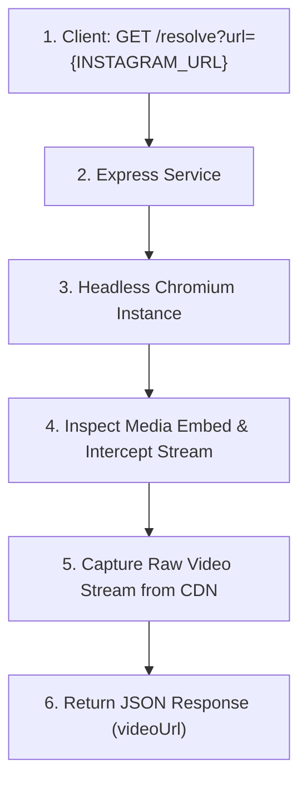

# Instagram Headless Chromium Media Resolver

A high-performance Node.js microservice that runs a lightweight headless Chromium instance to extract direct `.mp4` video streams from Instagram Reels, Posts, and Videos.

---

## Features

- **Automated Stream Interception:** Captures progressive video streams directly from Instagram CDN endpoints.
- **Optimized Performance:** Blocks unnecessary assets (images, stylesheets, fonts) to minimize memory usage and resolve media in seconds.
- **Flexible Parameters:** Accepts either a full Instagram URL or an extracted shortcode.
- **Docker-Ready:** Pre-configured Dockerfile with Chromium and runtime dependencies ready for deployment.

---

## How It Works



---

## Endpoints

### 1. Health Check
- **Endpoint:** `GET /`
- **Response:**
  ```json
  {
    "status": "online",
    "service": "Instagram Headless Resolver (Render)",
    "usage": "/resolve?shortcode=XYZ or /resolve?url=https://www.instagram.com/reel/XYZ/"
  }
  ```

### 2. Resolve Media Stream
- **Endpoint:** `GET /resolve?url={INSTAGRAM_URL}` or `GET /resolve?shortcode={SHORTCODE}`
- **Example Request:**
  ```bash
  curl "http://localhost:3000/resolve?url=https://www.instagram.com/reel/DbFXzUHoDFf/"
  ```
- **Success Response (`200 OK`):**
  ```json
  {
    "success": true,
    "shortcode": "DbFXzUHoDFf",
    "videoUrl": "https://scontent-xxx.cdninstagram.com/v/t50.2886-16/..."
  }
  ```
- **Error Response (`404 Not Found`):**
  ```json
  {
    "success": false,
    "error": "Unable to extract video stream. Post may be private or removed.",
    "shortcode": "DbFXzUHoDFf"
  }
  ```

---

## Local Development

### Option A: Using Docker (Recommended)

1. **Build Docker image:**
   ```bash
   docker build -t instagram-render-resolver .
   ```

2. **Run container:**
   ```bash
   docker run -p 3000:3000 instagram-render-resolver
   ```

3. Test the endpoint:
   ```bash
   curl "http://localhost:3000/resolve?shortcode=DbFXzUHoDFf"
   ```

### Option B: Running with Node.js directly

1. **Install dependencies:**
   ```bash
   npm install
   ```

2. **Set Chromium executable path (if not default):**
   ```bash
   # Windows (example)
   set PUPPETEER_EXECUTABLE_PATH="C:\Program Files\Google\Chrome\Application\chrome.exe"

   # Linux (example)
   export PUPPETEER_EXECUTABLE_PATH="/usr/bin/chromium"
   ```

3. **Start the server:**
   ```bash
   npm start
   ```

---

## Deployment on Render

1. Create a new **Web Service** on [Render](https://render.com).
2. Connect this repository.
3. Select **Docker** as the runtime environment.
4. Render will automatically build the `Dockerfile` and expose the service on port `3000`.

### Environment Variables

| Variable | Default | Description |
| :--- | :--- | :--- |
| `PORT` | `3000` | Port for the HTTP server to listen on |
| `PUPPETEER_EXECUTABLE_PATH` | `/usr/bin/chromium` | Path to the installed Chromium binary |
| `PUPPETEER_SKIP_CHROMIUM_DOWNLOAD` | `true` | Skips downloading bundled Chromium during install |
